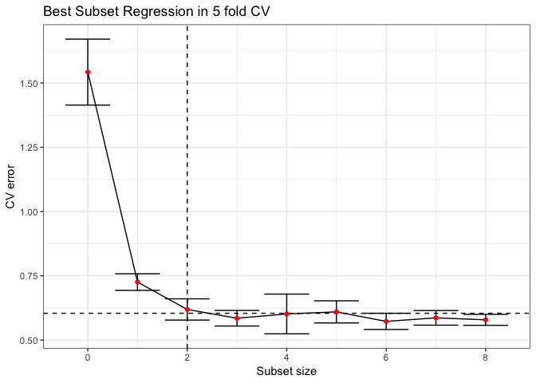
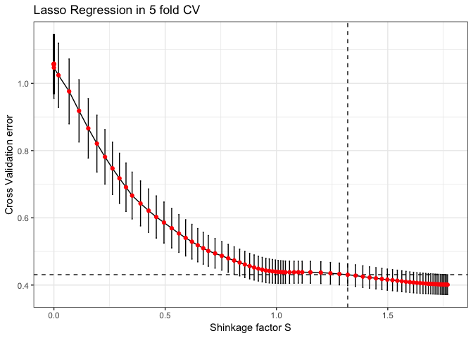
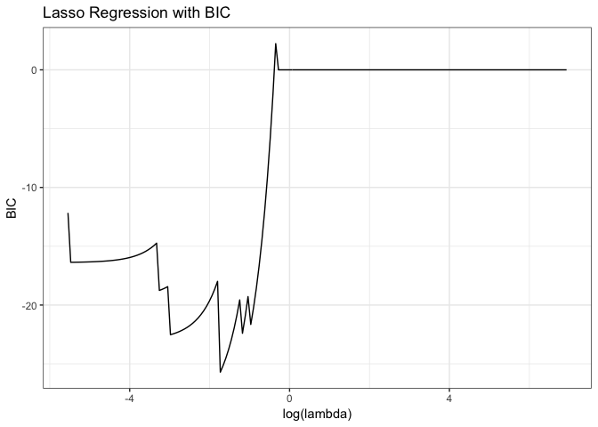
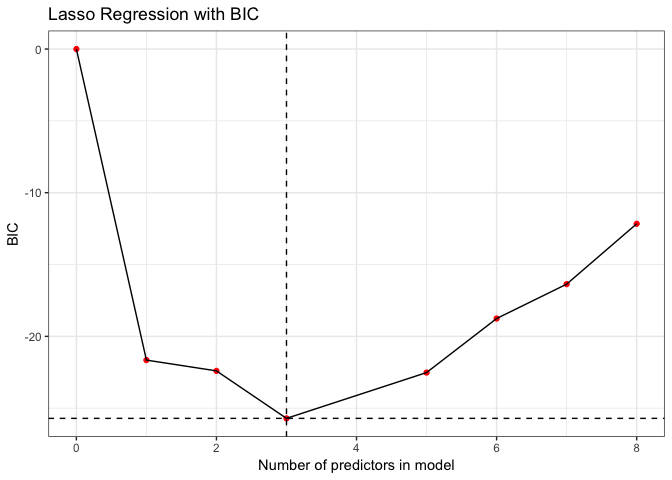
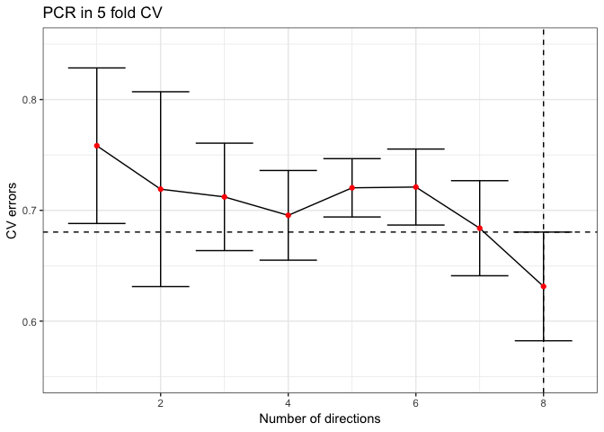

HW1
================
Sijia Yue
10/1/2019

Problem 2
---------

### (a)

Best subset has the smallest training RSS. Other two models may also yield the smallest training RSS, but best subset would yield in certain. Because all possible combinations of parameters are considered in given k in the best subset model and it finds the subset that minimizes the training error.

### (b)

Best subset has the smallest testing RSS for sure. But other two models might also find the smallest model by luck.

### (c)

-   1: True: Forward selection is a type of stepwise regression which begins with an empty model and adds in significant variables one by one. So the k+1 - variable model already contains the k - variable model.

-   2: True: Backward selection is a type of stepwise regression which begins with an full model and deletes in non-significant variables one by one. So the k+1 - variable model already contains the k - variable model.

-   3: False: The order of forward selection and backward selection are not exactly inverse steps. The selection may be affected by the p value in every step so the results could be different. So, the statement is not always correct.

-   4: False: Same as 3.

-   5: True: The k-variable model identified by best subset is defined as the model that has the smallest RSS. Same as the k+1 variable. So, the k+1 variable model does not have to include the varibales that selected in k variable model.

### Problem 3

The estimator of $\\hat \\beta$ for leat squares are:
$$\\hat \\beta^{ls}=(X^TX)^{-1}X^Ty$$
 In the case of orthonormal designs, the esimator would simplified as
$$\\hat \\beta^{ls} = X^Ty$$

#### Best subset

We know that the estimator of $\\hat \\beta$ for best subset is:
$$\\hat \\beta^{ls} = \\hat \\beta^{bss}(M=p)=X^Ty$$

In the case of orthorgonal designs, the coefficients are identical even if *M* ≤ *p* So, we get
$$\\hat \\beta^{bss} = \\hat \\beta^{ls}I(|\\hat \\beta^{ls}|\\ge|\\hat \\beta^{M}|)$$

#### Ridge Regression

We know that the estimator of $\\hat \\beta$ for best subset is:
$$\\hat \\beta^{Ridge} = (X^TX+I\\lambda)^{-1}X^Ty=(I+I\\lambda)^{-1}X^Ty=\\frac{\\hat \\beta^{ls}}{1+\\lambda}$$

#### Lasso Regression

For lasso regression, we get the following be definition:
*L*(*β*)=(*y* − *X**β*)<sup>*T*</sup>(*y* − *X**β*)+*λ*|*β*|
 Take the derivative at both side we get and set $\\hat \\beta$ as 0 we get:
$$\\hat \\beta^{Lasso} = X^Ty-\\lambda sign(\\beta)=sign(\\beta)(|X^Ty|-\\lambda)\_{+}=sign(\\beta)(|\\hat \\beta^{ls}|-\\lambda)\_{+}$$

Problem 4
---------

``` r
library(bestglm)
```

    ## Loading required package: leaps

Load data

``` r
set.seed(1234)
data(zprostate)
df_train = zprostate %>% filter(train=="TRUE")
df_test = zprostate %>% filter(train=="FALSE")
### Data for best subset selection
Xy = (df_train[df_train[,10],])[,-10]
```

### Best subset implementation in 5 fold CV

``` r
set.seed(1234)
bss_cv = bestglm(Xy, IC = "CV", CVArgs=list(Method="HTF", K=5, REP=1))
plot1 = bss_cv$Subsets
plot1$id = 0:8
cutoff1 = min(plot1$CV) + plot1$sdCV[which(plot1$CV == min(plot1$CV))]/sqrt(5)
ggplot(plot1, aes(x = id, y = CV)) +
  geom_errorbar(aes(ymin = CV - sdCV/sqrt(5), ymax = CV + sdCV/sqrt(5))) +
  geom_line()+
  geom_vline(xintercept = 2, linetype="dashed")+
  geom_hline(yintercept = cutoff1, linetype="dashed")+
  geom_point(color = "red")+
  labs(title = "Best Subset Regression in 5 fold CV",
       x = "Subset size",
       y = "CV error")+
  theme_bw()
```



``` r
bss.coef = 
  bss_cv$BestModel$coefficients %>% 
  broom::tidy() %>% 
  rename(BestSubset_CV = x) %>% 
  mutate(id = 1:3)
```

    ## Warning: 'tidy.numeric' is deprecated.
    ## See help("Deprecated")

Calculate test error and standard error

``` r
bss.pred = predict(bss_cv$BestModel, newdata = df_test)
bss.resid = df_test$lpsa - bss.pred
bss.err.test = mean(bss.resid^2)
bss.err.test.se = sqrt(var(bss.resid^2)/length(bss.resid))
```

### Best subset in BIC

``` r
set.seed(1234)
bss_bic = bestglm(Xy, IC = "BIC")
plot2 = bss_bic$Subset
cutoff2 = min(plot2$BIC)
plot2$id = 0:8
ggplot(plot2, aes(x = id, y = BIC)) +
  geom_line() +
  geom_point(color = "red") +
  geom_hline(yintercept = cutoff2, linetype = "dashed")+
  geom_vline(xintercept = 2, linetype = "dashed")+
  labs(title = "Best Subset Regression BIC",
       x = "Subset size",
       y = "CV error")+
  theme_bw()
```


``` r
bic.coef = 
  bss_bic$BestModel$coefficients %>% 
  broom::tidy() %>% 
  rename(BestSubset_BIC = x) %>% 
  mutate(id=1:3)
```

    ## Warning: 'tidy.numeric' is deprecated.
    ## See help("Deprecated")

``` r
bic.coef[,2:3]
```

    ## # A tibble: 3 x 2
    ##   BestSubset_BIC    id
    ##            <dbl> <int>
    ## 1          2.48      1
    ## 2          0.740     2
    ## 3          0.316     3

Calculate test error and standard error

``` r
bic.pred = predict(bss_bic$BestModel, newdata = df_test)
bic.resid = df_test$lpsa - bic.pred
bic.err.test = mean(bic.resid^2)
bic.err.test.se = sqrt(var(bic.resid^2)/length(bic.resid))
```

### Lasso Regression in 5 fold CV

``` r
library(glmnet)
```

    ## Warning: package 'glmnet' was built under R version 3.5.2

    ## Loading required package: Matrix

    ## 
    ## Attaching package: 'Matrix'

    ## The following object is masked from 'package:tidyr':
    ## 
    ##     expand

    ## Loading required package: foreach

    ## 
    ## Attaching package: 'foreach'

    ## The following objects are masked from 'package:purrr':
    ## 
    ##     accumulate, when

    ## Loaded glmnet 2.0-18

``` r
df = read_csv("Prostate Cancer.txt")
```

    ## Parsed with column specification:
    ## cols(
    ##   id = col_integer(),
    ##   lcavol = col_double(),
    ##   lweight = col_double(),
    ##   age = col_integer(),
    ##   lbph = col_double(),
    ##   svi = col_integer(),
    ##   lcp = col_double(),
    ##   gleason = col_integer(),
    ##   pgg45 = col_integer(),
    ##   lpsa = col_double(),
    ##   train = col_logical()
    ## )

``` r
# df[,2:9] = scale(df[,-1])[[1]]
df_train = df %>% filter(train == "TRUE") 
x_train = scale(df_train[,2:9]) %>% as_tibble()
y_train = scale(df_train$lpsa) %>% as.vector()
df_test = df %>% filter(train == "FALSE") 
x_test = scale(df_test[,2:9]) %>% as_tibble()
y_test = scale(df_test$lpsa) %>% as.vector()

set.seed(1234)
lasso_cv = cv.glmnet(as.matrix(x_train), y_train, type.measure = "mse", alpha = 1, lambda = 2^seq(-8,4,0.1),  family = "gaussian", nfolds = 5)

s = coef.cv.glmnet(lasso_cv, s = lasso_cv$lambda) %>% 
  apply(., 2, function(col){sum(abs(col))})
se = lasso_cv$cvsd/sqrt(5)

#plot(lasso_cv, xvar = "lambda")
plot3 = data.frame(lasso_cv$lambda, lasso_cv$cvm, se, s = s) %>% 
  rename(lambda = lasso_cv.lambda,
         cvm = lasso_cv.cvm)
cutoff3 = min(plot3$cvm) + se[which(plot3$cvm == min(plot3$cvm))]

s_vline = plot3$s[which(max(plot3$cvm[which(plot3$cvm < cutoff3)]) == plot3$cvm)]
lambda_best = plot3$lambda[which(max(plot3$cvm[which(plot3$cvm < cutoff3)]) == plot3$cvm)]
plot3 %>% 
ggplot(aes(x = s, y = cvm)) +
  geom_errorbar(aes(ymin = cvm - se, ymax = cvm + se)) +
  geom_line()+
  geom_hline(yintercept = cutoff3, linetype = "dashed") +
  geom_vline(xintercept = s_vline, linetype = "dashed") +
  geom_point(color = "red") +
  labs(x = "Shinkage factor S",
       y = "Cross Validation error",
       title = "Lasso Regression in 5 fold CV")+
  theme_bw()
```



``` r
lasso.coef = 
  coef.cv.glmnet(lasso_cv, s = lambda_best) %>% 
  as.matrix() %>% 
  as.tibble() %>% 
  rename(LASSO_CV = `1`) %>% 
  mutate(id = 1:9)
```

``` r
pred.lasso = predict.cv.glmnet(lasso_cv, newx = as.matrix(x_test), s = lambda_best)
resid = pred.lasso - y_test
test.lasso.cv = mean(resid^2)
test.lasso.cv.se = sqrt( var(resid^2) / length(resid) )
```

### Lasso regression with BIC

``` r
set.seed(1234)
lasso_bic = glmnet(as.matrix(x_train), y_train,  alpha = 1, lambda = 2^seq(-8,10,0.1),  family = "gaussian")

tLL = lasso_bic$nulldev - deviance(lasso_bic)
k <- lasso_bic$df
n <- lasso_bic$nobs
BIC <- log(n)*k - tLL
lambda <- lasso_bic$lambda


plot4 = data_frame(tLL, k, n, BIC, lambda)
bic_df = 
  plot4 %>% 
  group_by(k) %>% 
  summarise(bic = min(BIC))

ggplot(plot4, aes(x = log(lambda), y = BIC)) +
  geom_path()+
  labs(title = "Lasso Regression with BIC") +
  theme_bw()
```



``` r
cutoff4 = min(bic_df$bic)
lambda_best = plot4 %>% filter(k == 3) %>% filter(BIC == min(BIC)) %>% pull(lambda)
ggplot(bic_df,aes(x = k, y = bic)) +
  geom_point( color = "red") +
  geom_path() +
  geom_hline(yintercept = cutoff4, linetype = "dashed") +
  geom_vline(xintercept = 3, linetype = "dashed") +
  labs(x = "Number of predictors in model",
       y = "BIC",
       title = "Lasso Regression with BIC")+
  theme_bw()
```



``` r
coef.lasso.bic = 
  coef(lasso_bic, s = lambda_best) %>%
  as.matrix() %>% 
  as.tibble() %>% 
  rename(Lasso_BIC = `1`) %>% 
  mutate(id = 1:9)
```

``` r
pred = predict(lasso_bic, s = lambda_best, newx = as.matrix(x_test))
resid = pred - y_test
test.error.lasso.bic = mean(resid^2)
test.error.se.lasso.bic = sqrt(var(resid^2)/length(resid))
```

### PCR with 5 fold CV

``` r
library(caret)
```

    ## Loading required package: lattice

    ## 
    ## Attaching package: 'caret'

    ## The following object is masked from 'package:purrr':
    ## 
    ##     lift

``` r
library(plsdof)
```

    ## Warning: package 'plsdof' was built under R version 3.5.2

    ## Loading required package: MASS

    ## 
    ## Attaching package: 'MASS'

    ## The following object is masked from 'package:dplyr':
    ## 
    ##     select

``` r
set.seed(12)
ctrl = trainControl(method = "cv", number = 5)
pcr.fit = train(x = as.matrix(x_train),
      y = y_train,
      method = "pcr",
      tuneGrid = data.frame(ncomp = 1:8),
      trControl = ctrl)

cv = pcr.fit$results$RMSE
cv_error = pcr.fit$results$RMSESD/sqrt(5)
cutoff5 = min(cv) + cv_error[cv == min(cv)]
m = 1:8
plot5 = data_frame(cv, cv_error,m)

m_vline = min(plot5$m[which(plot5$cv < cutoff5)])


ggplot(plot5, aes(x = m, y = cv)) +
  geom_errorbar(ymin = cv - cv_error, ymax = cv + cv_error) +
  geom_line() +
  geom_hline(yintercept = cutoff5, linetype = "dashed") +
  geom_vline(xintercept = m_vline, linetype = "dashed") +
  geom_point(color = "red") +
  ylim(0.55,0.85)+
  labs(x = "Number of directions",
       y = "CV errors",
       title = "PCR in 5 fold CV")+
  theme_bw()
```



``` r
coef.pcr = 
  coef(pcr.fit$finalModel) %>% 
  as.tibble() %>% 
  mutate(id = 2:9) %>% 
  rename(PCR = `.outcome.8 comps`)
```

``` r
pred = predict(pcr.fit, newx = x_test)
resid = pred - y_test
```

    ## Warning in pred - y_test: longer object length is not a multiple of shorter
    ## object length

``` r
test.error.pcr = mean(resid^2)
test.error.se.pcr = sqrt(var(resid^2)/length(resid))
```

### Summary table

``` r
variables = c("intercept", "lcavol", "lweight", "age", "lbph","svi", "lcp", "gleason", "pgg45", "test error", "standard error")
id = 1:9
names = data_frame(id )

test_error = c(test.lasso.cv, test.error.lasso.bic, test.error.pcr, bic.err.test, bss.err.test)
standard_error = c(test.lasso.cv.se, test.error.se.lasso.bic, test.error.se.pcr,bic.err.test.se ,bss.err.test.se)

summary_table = 
  full_join(names, lasso.coef, by = "id") %>% 
  full_join(., coef.lasso.bic, by = "id") %>% 
  full_join(., coef.pcr, by = "id") %>% 
  full_join(., bic.coef[,2:3], by = "id") %>% 
  full_join(., bss.coef[,2:3], by = "id") %>% 
  dplyr::select(-id) %>% 
  rbind(test_error, standard_error) %>% 
  cbind(variables) %>% 
  dplyr::select(variables, everything()) %>% 
  knitr::kable(digits = 2)
summary_table
```

| variables      |  LASSO\_CV|  Lasso\_BIC|    PCR|  BestSubset\_BIC|  BestSubset\_CV|
|:---------------|----------:|-----------:|------:|----------------:|---------------:|
| intercept      |       0.00|        0.00|     NA|             2.48|            2.48|
| lcavol         |       0.51|        0.46|   0.59|             0.74|            0.74|
| lweight        |       0.22|        0.15|   0.24|             0.32|            0.32|
| age            |      -0.05|        0.00|  -0.12|               NA|              NA|
| lbph           |       0.15|        0.00|   0.18|               NA|              NA|
| svi            |       0.20|        0.08|   0.26|               NA|              NA|
| lcp            |      -0.07|        0.00|  -0.24|               NA|              NA|
| gleason        |       0.00|        0.00|  -0.02|               NA|              NA|
| pgg45          |       0.12|        0.00|   0.23|               NA|              NA|
| test error     |       0.44|        0.44|   1.65|             0.49|            0.49|
| standard error |       0.14|        0.15|   0.31|             0.14|            0.14|

To summarize, I would choose the lasso regression for parsimony consideration and it reaches the smallest test error and standard error.
