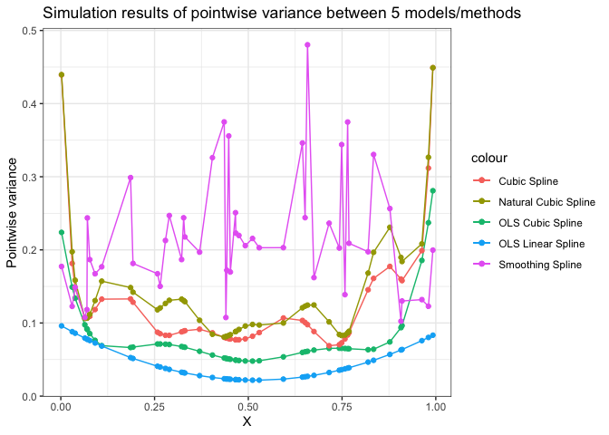

HW2
================
Sijia Yue
10/14/2019

Problem 3: simulation study
---------------------------

### Generate uniform \[0,1\]

``` r
set.seed(20)
x = runif(50, min = 0, max = 1)
```

### Generate 100 training sets

``` r
sim_train = list()
for (i in 1:100) {
  set.seed(i)
  y = sin(2*pi*x^3)^3 + rnorm(50, mean = 0, sd = 1)
  sim_train[[i]] = cbind(x,y)
}
```

### Fit OLS with linear model in each training set and get the vector of fitted value $\\hat y$

``` r
ols_linear_pred = list()
for (i in 1:100) {
  fit = lm(y~x, data = sim_train[[i]] %>% as.data.frame())
  pred = predict(fit)
  ols_linear_pred[[i]] = pred
}
ols_linear_pred = bind_cols(ols_linear_pred)
```

### Fit OLS with cubic polynomial model in each training set and get the vector of fitted value $\\hat y$

``` r
ols_cub_pred = list()
for (i in 1:100) {
  fit = lm(y~poly(x,3), data = sim_train[[i]] %>% as.data.frame())
  pred = predict(fit)
  ols_cub_pred[[i]] = pred
}
ols_cub_pred = bind_cols(ols_cub_pred)
```

### Fit cubic spline with knot 0.33 and 0.67 in each training set and get the vector of fitted value $\\hat y$

``` r
cub_spline_pred = list()
for (i in 1:100) {
  fit = lm(y~bs(x,knots=c(0.33,0.67)), data = sim_train[[i]] %>% as.data.frame())
  pred = predict(fit)
  cub_spline_pred[[i]] = pred
}
cub_spline_pred = bind_cols(cub_spline_pred)
```

### Fit natural cubic spline with 5 knots at 0.1, 0.3, 0.5, 0.7 and 0.9 in each training set and get the vector of fitted value $\\hat y$

``` r
ncub_spline_pred = list()
for (i in 1:100) {
  fit = lm(y~ns(x,knots=c(0.1,0.3,0.5,0.7,0.9)), data = sim_train[[i]] %>% as.data.frame())
  pred = predict(fit)
  ncub_spline_pred[[i]] = pred
}
ncub_spline_pred = bind_cols(ncub_spline_pred)
```

### Fit smoothing spline with tuning parameter chosen by GCV in each training set and get the vector of fitted value $\\hat y$

``` r
smooth_spline_pred = list()
for (i in 1:100) {
  fit = smooth.spline(x=sim_train[[i]][,1], y =sim_train[[i]][,2], cv=FALSE)
  pred = predict(fit)$y
  smooth_spline_pred[[i]] = pred
}
smooth_spline_pred = bind_cols(smooth_spline_pred)
```

### For each method/model, compute the pointwise variance of fitted values across the 100 training sets. This gives you a vector of pointwise variance.

``` r
ols_linear_var = apply(ols_linear_pred, 1, var)
ols_cub_var = apply(ols_cub_pred, 1, var)
cub_spline_var = apply(cub_spline_pred, 1, var)
ncub_spline_var = apply(ncub_spline_pred, 1,var)
smooth_spline_var = apply(smooth_spline_pred, 1,var)
var_df = data_frame(x,ols_linear_var,ols_cub_var,cub_spline_var,ncub_spline_var,smooth_spline_var)
```

    ## Warning: `data_frame()` is deprecated, use `tibble()`.
    ## This warning is displayed once per session.

### Plot the pointwise variance curves (against x) for each method/model.

``` r
ggplot(var_df) +
  geom_line(aes(x = x, y = ols_cub_var, color = "OLS Cubic Spline")) +
  geom_point(aes(x = x, y = ols_cub_var, color = "OLS Cubic Spline")) +
  geom_line(aes(x = x, y = ols_linear_var, color = "OLS Linear Spline")) +
  geom_point(aes(x = x, y = ols_linear_var, color = "OLS Linear Spline")) +
  geom_line(aes(x = x, y = cub_spline_var, color = "Cubic Spline")) +
  geom_point(aes(x = x, y = cub_spline_var, color = "Cubic Spline")) +
  geom_line(aes(x = x, y = ncub_spline_var, color = "Natural Cubic Spline")) +
  geom_point(aes(x = x, y = ncub_spline_var, color = "Natural Cubic Spline")) +
  geom_line(aes(x = x, y = smooth_spline_var, color = "Smoothing Spline")) +
  geom_point(aes(x = x, y = smooth_spline_var, color = "Smoothing Spline")) +
  theme_bw()+
  labs(title = "Simulation results of pointwise variance between 5 models/methods",
       x = "X",
       y = "Pointwise variance")
```



Problem 4
---------

Data preparation

``` r
df = read.table("http://www-stat.stanford.edu/~tibs/ElemStatLearn/datasets/SAheart.data",
    sep=",",head=T,row.names=1)
df_train = df[1:300,]
df_test = df[301:462,]
```

### Logistic regression

``` r
logistic_fit = glm(chd~., data = df_train, family = "binomial")
summary(logistic_fit)
```

    ## 
    ## Call:
    ## glm(formula = chd ~ ., family = "binomial", data = df_train)
    ## 
    ## Deviance Residuals: 
    ##     Min       1Q   Median       3Q      Max  
    ## -1.8176  -0.8282  -0.4348   0.9484   2.4491  
    ## 
    ## Coefficients:
    ##                 Estimate Std. Error z value Pr(>|z|)   
    ## (Intercept)    -5.013991   1.570094  -3.193  0.00141 **
    ## sbp            -0.004784   0.007500  -0.638  0.52356   
    ## tobacco         0.069165   0.032321   2.140  0.03236 * 
    ## ldl             0.111462   0.074524   1.496  0.13474   
    ## adiposity       0.046678   0.037295   1.252  0.21072   
    ## famhistPresent  0.826525   0.280107   2.951  0.00317 **
    ## typea           0.046926   0.015911   2.949  0.00319 **
    ## obesity        -0.063287   0.053181  -1.190  0.23404   
    ## alcohol         0.005111   0.005927   0.862  0.38849   
    ## age             0.039145   0.014631   2.675  0.00746 **
    ## ---
    ## Signif. codes:  0 '***' 0.001 '**' 0.01 '*' 0.05 '.' 0.1 ' ' 1
    ## 
    ## (Dispersion parameter for binomial family taken to be 1)
    ## 
    ##     Null deviance: 394.29  on 299  degrees of freedom
    ## Residual deviance: 317.75  on 290  degrees of freedom
    ## AIC: 337.75
    ## 
    ## Number of Fisher Scoring iterations: 4

``` r
log_pred = predict(logistic_fit, newdata = df_test[,-10], type = "response")
log_pred = if_else(log_pred>= 0.5,1,0)
log_error = mean((log_pred != df_test$chd)^2)
log_error_se = sd((log_pred != df_test$chd)^2)/sqrt(nrow(df_test))
```

### LDA

``` r
lda_fit = lda(chd~., data = df_train)
lda_fit$means
```

    ##        sbp  tobacco      ldl adiposity famhistPresent    typea  obesity
    ## 0 134.0105 2.629368 4.468421  23.29147      0.2947368 53.04211 25.57868
    ## 1 138.9091 5.433818 5.451545  27.90682      0.5545455 56.28182 26.76291
    ##    alcohol      age
    ## 0 12.41268 38.02632
    ## 1 18.75418 49.47273

``` r
lda_pred = predict(lda_fit, df_test[,-10])$class
lda_error = mean((lda_pred != df_test$chd)^2)
lda_error_se = sd((lda_pred != df_test$chd)^2)/sqrt(nrow(df_test))
```

### QDA

``` r
qda_fit = qda(chd~., data = df_train)
qda_fit$means
```

    ##        sbp  tobacco      ldl adiposity famhistPresent    typea  obesity
    ## 0 134.0105 2.629368 4.468421  23.29147      0.2947368 53.04211 25.57868
    ## 1 138.9091 5.433818 5.451545  27.90682      0.5545455 56.28182 26.76291
    ##    alcohol      age
    ## 0 12.41268 38.02632
    ## 1 18.75418 49.47273

``` r
qda_pred = predict(qda_fit, df_test[,-10])$class
qda_error = mean((qda_pred != df_test$chd)^2)
qda_error_se = sd((qda_pred != df_test$chd)^2)/sqrt(nrow(df_test))
```

### Summarize the test error and its standard error into one form

``` r
log = cbind("Logistic Regression",log_error,log_error_se)
lda = cbind("LDA",lda_error, lda_error_se)
qda = cbind("QDA",qda_error, qda_error_se)

summary = rbind(log, lda, qda)
colnames(summary) = c("Names","d","s")
summary = summary %>% as_tibble() %>% 
  dplyr::mutate(d = as.numeric(d),
                s = as.numeric(s)) 
colnames(summary) = c("Models","Test Error","SE")
summary %>% 
  knitr::kable(digits = 4)
```

| Models              |  Test Error|      SE|
|:--------------------|-----------:|-------:|
| Logistic Regression |      0.2531|  0.0343|
| LDA                 |      0.2531|  0.0343|
| QDA                 |      0.2593|  0.0345|

The test error of logistic regression and LDA shows the same results. The test error of QDA is slightly greater than LDA and logistic regression. All the standard error are pretty similar. I would choose to use logistic regression as my final model since the test error is the smallest and it is easier to interpret.
