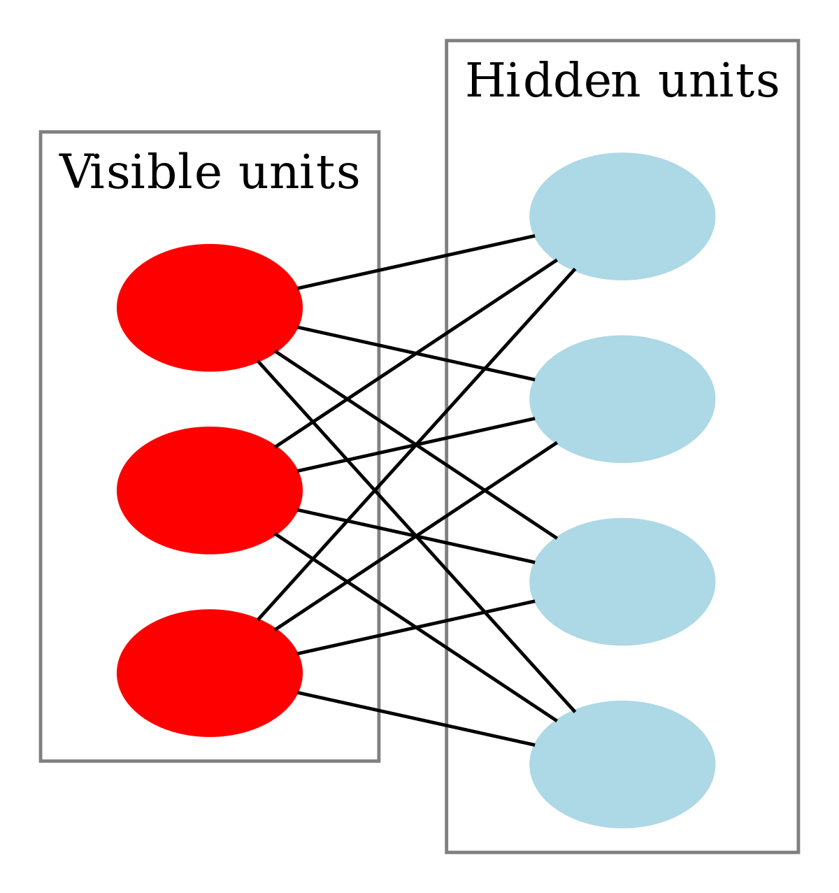

### Introduction

Restricted Boltzmann Machine is an undirected graphical model. RBMs can be used for data reduction (like PCA) and can also be adjusted for classification purposes. 

RBMs consist of only two layers of nodes, a hidden layer with hidden nodes and a visible layer consisting of nodes that represent the data. In most applications the visible layer is represented by binary units. Here is a graphical representation of the RBM below:

```{r, include=FALSE}

```

```{r setup}
library(devtools)
library(RBM)
```

### Load MNIST data

The MNIST dataset is a hand-written numbers dataset and was downloaded from Kaggle. The library already has the dataset built in.

```{r}
data(MNIST)
train <- MNIST$trainX
test <- MNIST$testX
TrainY <- MNIST$trainY
TestY <- MNIST$testY

```

Try to plot a digit.
```{r}
image(matrix(MNIST$trainX[2, ], nrow = 28), col = grey(seq(0, 1, length = 256)))
```

### Using RBM()

Use RBM() to fit the Restricted Boltzmann Machine model onto the MNIST dataset.

RBM() arguments

* x: binary features

* y: outcomes (optional: only needed in binary classification) 

* n.iter: number of iterations

* n.hidden: number of nodes in hidden layer

* learning.rate: learning rate ($\alpha$)

* size.minibatch: size of minibatches

* lambda: sparsity penalty lambda ($\lambda$) to prevent the system from overfitting

```{r}
modelRBM <- RBM(x = train, n.iter = 1000, n.hidden = 100, size.minibatch = 10, lambda = 0.1)
```

After training the RBM model you can check how well it reconstructs the data with the ReconstructRBM() function:

```{r}
ReconstructRBM(test = test[6, ], model = modelRBM)
ReconstructRBM(test = test[23, ], model = modelRBM)
```

### Use RBM() in classification problems

We can use the `RBM()` function again, the only difference is that we now also provide the labels as the y argument:

```{r}
modelClassRBM <- RBM(x = train, y = TrainY, n.iter = 1000, n.hidden = 100, size.minibatch = 10, lambda = 0.1)
```

Then use `PredictRBM()` function for prediction.

This function would return two parameters:

* ConfusionMatrix

* Accuracy
```{r}
predRBM <- PredictRBM(test = test, labels = TestY, model = modelClassRBM)
predRBM$ConfusionMatrix
predRBM$Accuracy
```

Reference:
https://github.com/TimoMatzen/RBM#restricted-boltzmann-machine