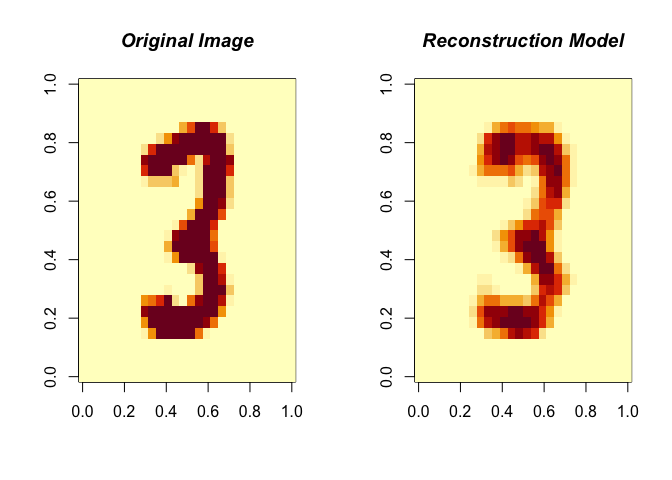
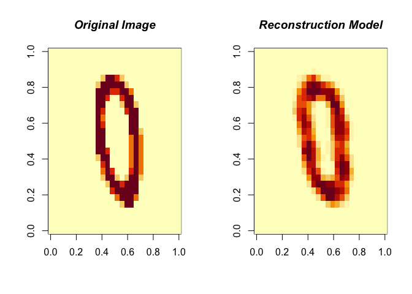

Restricted Boltzmann Machine
================
Sijia Yue
10/16/2019

### Load MNIST data

The MNIST dataset is a hand-written numbers dataset and was downloaded from Kaggle. The library already has the dataset built in.

``` r
data(MNIST)
train <- MNIST$trainX
test <- MNIST$testX
TrainY <- MNIST$trainY
TestY <- MNIST$testY
```

Try to plot a digit.

``` r
image(matrix(MNIST$trainX[2, ], nrow = 28), col = grey(seq(0, 1, length = 256)))
```


### Using RBM()

Use RBM() to fit the Restricted Boltzmann Machine model onto the MNIST dataset.

RBM() arguments \* x: binary features \* y: outcomes (optional: only needed in binary classification) \* n.iter: number of iterations \* n.hidden: number of nodes in hidden layer \* learning.rate: learning rate (*α*) \* size.minibatch: size of minibatches \* lambda: sparsity penalty lambda to prevent the system from overfitting

``` r
modelRBM <- RBM(x = train, n.iter = 1000, n.hidden = 100, size.minibatch = 10, lambda = 0.1)
```

After training the RBM model you can check how well it reconstructs the data with the ReconstructRBM() function:

``` r
ReconstructRBM(test = test[6, ], model = modelRBM)
```



``` r
ReconstructRBM(test = test[23, ], model = modelRBM)
```



### Use RBM() in classification problems

We can use the `RBM()` function again, the only difference is that we now also provide the labels as the y argument:

``` r
modelClassRBM <- RBM(x = train, y = TrainY, n.iter = 1000, n.hidden = 100, size.minibatch = 10, lambda = 0.1)
```

Then use `PredictRBM()` function for prediction.

This function would return two parameters: \* ConfusionMatrix \* Accuracy

``` r
predRBM <- PredictRBM(test = test, labels = TestY, model = modelClassRBM)
predRBM$ConfusionMatrix
```

    ##     truth
    ## pred   0   1   2   3   4   5   6   7   8   9
    ##    0 190   0   3   1   2   3   3   1   1   4
    ##    1   0 214   1   3   2   2   0   1   3   0
    ##    2   0   0 153   4   0   0   1   3   0   1
    ##    3   0   3   6 171   0  17   0   0   6   3
    ##    4   0   0   1   0 178   4   1   1   3   5
    ##    5   0   0   0   2   0 122   1   0   2   2
    ##    6   3   1   6   5   5   6 208   0   6   0
    ##    7   0   1   5   1   2   1   0 185   1  15
    ##    8   4   5   9   7   4   6   2   1 151   1
    ##    9   0   1   6   4  33   1   0  10   6 174

``` r
predRBM$Accuracy
```

    ## [1] 0.873
