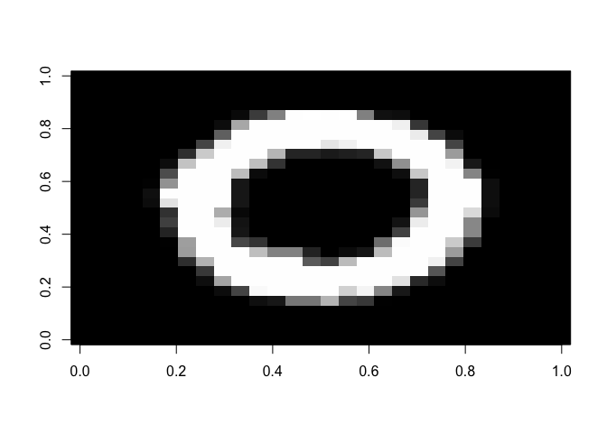
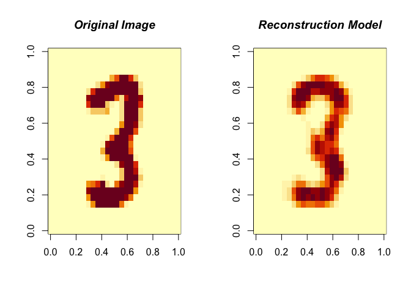

RBM
================
Sijia Yue
10/16/2019

``` r
# Load MNIST data
data(MNIST)
train <- MNIST$trainX
test <- MNIST$testX
TrainY <- MNIST$trainY
TestY <- MNIST$testY
image(matrix(MNIST$trainX[2, ], nrow = 28), col = grey(seq(0, 1, length = 256)))
```



``` r
# Using RBM()
modelRBM <- RBM(x = train, n.iter = 1000, n.hidden = 100, size.minibatch = 10)
# Reconstruct the image with modelRBM
ReconstructRBM(test = test[6, ], model = modelRBM)
```



``` r
# Use RBM() in classification problems

# This time we add the labels as the y argument
modelClassRBM <- RBM(x = train, y = TrainY, n.iter = 1000, n.hidden = 100, size.minibatch = 10)
predRBM <- PredictRBM(test = test, labels = TestY, model = modelClassRBM)
predRBM$ConfusionMatrix
```

    ##     truth
    ## pred   0   1   2   3   4   5   6   7   8   9
    ##    0 184   0   4   1   4   7   2   0   5   1
    ##    1   0 208   0   0   1   4   0   1   4   0
    ##    2   0   2 168  13   3   1   4   3   0   4
    ##    3   0   5   5 160   0  13   0   3   7   2
    ##    4   1   1   1   1 178   5   3   7   5  12
    ##    5   5   0   1   8   2 112   3   1   7   5
    ##    6   2   2   1   6   5   4 199   0   3   0
    ##    7   0   1   3   1   4   2   0 177   0  18
    ##    8   4   5   4   2   7  11   5   0 142   3
    ##    9   1   1   3   6  22   3   0  10   6 160

``` r
predRBM$Accuracy
```

    ## [1] 0.844
