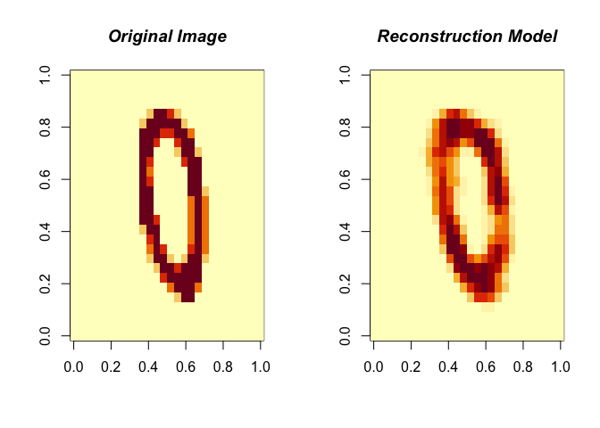

Restricted Boltzmann Machine
================
Sijia Yue
10/16/2019

``` r
library(devtools)
```

    ## Loading required package: usethis

``` r
library(RBM)
```

### Load MNIST data

The MNIST dataset is a hand-written numbers dataset and was downloaded from Kaggle. The library already has the dataset built in.

``` r
data(MNIST)
train <- MNIST$trainX
test <- MNIST$testX
TrainY <- MNIST$trainY
TestY <- MNIST$testY
```

Try to plot a digit.

``` r
image(matrix(MNIST$trainX[2, ], nrow = 28), col = grey(seq(0, 1, length = 256)))
```


### Using RBM()

Use RBM() to fit the Restricted Boltzmann Machine model onto the MNIST dataset.

RBM() arguments

-   x: binary features

-   y: outcomes (optional: only needed in binary classification)

-   n.iter: number of iterations

-   n.hidden: number of nodes in hidden layer

-   learning.rate: learning rate (*α*)

-   size.minibatch: size of minibatches

-   lambda: sparsity penalty lambda (*λ*) to prevent the system from overfitting

``` r
modelRBM <- RBM(x = train, n.iter = 1000, n.hidden = 100, size.minibatch = 10, lambda = 0.1)
```

After training the RBM model you can check how well it reconstructs the data with the ReconstructRBM() function:

``` r
ReconstructRBM(test = test[6, ], model = modelRBM)
```


``` r
ReconstructRBM(test = test[23, ], model = modelRBM)
```



### Use RBM() in classification problems

We can use the `RBM()` function again, the only difference is that we now also provide the labels as the y argument:

``` r
modelClassRBM <- RBM(x = train, y = TrainY, n.iter = 1000, n.hidden = 100, size.minibatch = 10, lambda = 0.1)
```

Then use `PredictRBM()` function for prediction.

This function would return two parameters:

-   ConfusionMatrix

-   Accuracy

``` r
predRBM <- PredictRBM(test = test, labels = TestY, model = modelClassRBM)
predRBM$ConfusionMatrix
```

    ##     truth
    ## pred   0   1   2   3   4   5   6   7   8   9
    ##    0 191   0   5   3   1  10   3   0   2   3
    ##    1   0 213   1   0   1   5   0   3   4   0
    ##    2   0   1 164   6   3   2   2   2   1   1
    ##    3   0   2   4 168   0   8   0   0   5   1
    ##    4   0   0   3   0 182   2   0   2   2   8
    ##    5   1   0   1   9   2 118   3   0   6   2
    ##    6   2   1   1   2   3   6 206   0   5   0
    ##    7   0   1   5   1   1   1   0 181   1   6
    ##    8   3   6   4   2   2   7   2   0 149   1
    ##    9   0   1   2   7  31   3   0  14   4 183

``` r
predRBM$Accuracy
```

    ## [1] 0.8775

Reference: <https://github.com/TimoMatzen/RBM#restricted-boltzmann-machine>
